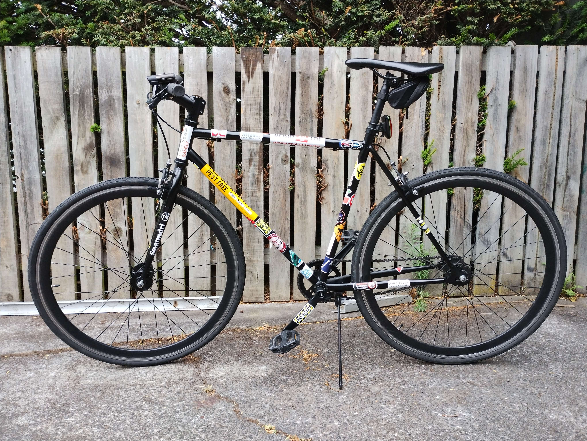

# Bike

This repository contains design and source files for an electrical system for my bicycle. The 
intention is to develop the bicycle design in stages.

 1. Develop a set of lights and power supply that are integrated into the bicycle. 
 2. Develop a user interface for controlling the lights (including brake sensing system).
 3. Develop a bike computer that records speed and travel distance.

For these stages to go ahead it is necessary to develop a [mechanical model of the bicycle](./mech/) 
and [a set of requirements](./docs/). 